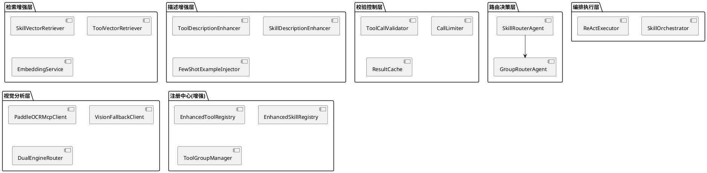

# **1. 实现模型**

## **1.1 上下文视图**

### 系统上下文

```plantuml
@startuml
left to right direction

actor "终端用户" as User
actor "运维人员" as Admin
actor "Skill开发者" as Dev

rectangle "AI Agent Platform\n工具路由优化系统" as System {
  rectangle "Skill路由层" as SkillRouter
  rectangle "工具分组路由层" as GroupRouter
  rectangle "动态检索层" as DynamicRetriever
  rectangle "描述增强层" as Enhancer
  rectangle "调用校验层" as Validator
  rectangle "视觉分析层" as VisionLayer
  rectangle "Skill编排引擎" as Orchestrator
}

system "百炼LLM API\n(DashScope)" as LLM
system "ToolRegistry\n(增强版)" as ToolReg
system "SkillRegistry\n(增强版)" as SkillReg
system "Python数据服务" as DataService
system "RAG检索服务" as RAG
system "PaddleOCR-VL-1.6\nMCP Server (Docker)" as PaddleOCR
system "Vision模型\n(qwen3.5-plus 降级)" as Vision
system "MinerU API" as MinerU
system "Embedding服务\n(bge-m3)" as Embedding

User --> System : 金融分析query / 金融文档截图
System --> LLM : 含Skill/工具增强描述的prompt
LLM --> System : Skill选择/工具调用指令
System --> SkillRouter : 优先Skill路由
SkillRouter --> GroupRouter : Skill匹配失败降级
System --> DynamicRetriever : 语义检索Skill/Tool
System --> ToolReg : 查询/执行工具
System --> SkillReg : 匹配/执行Skill编排
System --> DataService : 调用市场数据工具
System --> RAG : 调用hybridSearch
System --> PaddleOCR : OCR/结构化提取(主力引擎)
PaddleOCR --> System : 返回OCR解析结果
System --> Vision : 降级调用(仅PaddleOCR失败时)
System --> MinerU : 研报结构化解析
System --> Embedding : 计算query/Skill/Tool embedding
Admin --> System : 配置分组/Skill/检索参数/环境变量
Dev --> System : 定义Skill编排/投研Skill/视觉Skill
System --> User : 最终整合回答/结构化结果
@enduml
```

### 核心决策流

```
用户Query → [Skill路由] → 命中Skill? 
  → Yes: 加载Skill关联Tool → [校验] → [编排执行] → 结果
  → No: [工具分组路由] → 命中分组? 
    → Yes: [组内语义检索] → [校验] → [ReAct执行] → 结果
    → No: [全量工具降级] → [校验] → [ReAct执行] → 结果
```

## **1.2 服务/组件总体架构**

### 分层架构



### 模块依赖关系

| 模块 | 依赖 | 被依赖 |
|------|------|--------|
| SkillRouterAgent | EnhancedSkillRegistry, SkillVectorRetriever | 无 |
| GroupRouterAgent | ToolGroupManager | SkillRouterAgent(降级) |
| SkillVectorRetriever | EmbeddingService, EnhancedSkillRegistry | SkillRouterAgent |
| ToolVectorRetriever | EmbeddingService, EnhancedToolRegistry | GroupRouterAgent |
| ToolCallValidator | EnhancedToolRegistry | SkillOrchestrator, ReActExecutor |
| SkillOrchestrator | EnhancedSkillRegistry, ToolCallValidator, CallLimiter | ReActExecutor |
| PaddleOCRMcpClient | MCP协议 | DualEngineRouter |
| VisionFallbackClient | DashScope API | DualEngineRouter |
| DualEngineRouter | PaddleOCRMcpClient, VisionFallbackClient | 视觉Skill |

## **1.3 实现设计文档**

### 模块1：Skill路由与编排

#### 1.3.1 SkillRouterAgent

**职责**：顶层路由Agent，优先匹配Skill，匹配失败降级到工具分组路由

**接口签名**：

```typescript
// src/server/agents/routing/skill-router.ts

interface SkillRouteResult {
  matched: boolean;
  skill?: SkillDefinition;       // 匹配的Skill
  confidence: number;            // 匹配置信度 0-1
  routeType: "skill" | "group_fallback" | "full_fallback";
  relatedGroups?: string[];      // Skill关联的工具分组ID列表
}

class SkillRouterAgent {
  private skillRegistry: EnhancedSkillRegistry;
  private skillRetriever: SkillVectorRetriever;
  private groupRouter: GroupRouterAgent;
  private readonly CONFIDENCE_THRESHOLD = 0.6;

  async route(query: string): Promise<SkillRouteResult>;
  // 1. 先用关键词快速匹配
  // 2. 关键词无结果时用语义向量检索
  // 3. 置信度低于阈值时降级到GroupRouterAgent
  // 4. 匹配成功时自动加载Skill关联的所有工具组
}
```

**增强SkillRegistry**：

```typescript
// src/server/agents/skills/enhanced-registry.ts

interface EnhancedSkillDefinition extends SkillDefinition {
  applicableScenarios: string;          // 适用场景描述
  orchestrationSummary: string;        // 编排步骤概要
  typicalQueries: string[];            // 典型query示例
  relatedTools: string[];              // 关联Tool名称列表
  relatedGroups: string[];             // 关联工具分组ID列表
  errorRecovery: ErrorRecoveryStrategy;// 错误恢复策略
  skillCategory: SkillCategory;        // Skill分类
  timeoutMs: number;                   // 编排超时时间
}

type SkillCategory = 
  | "investment_analysis" 
  | "risk_compliance" 
  | "comprehensive_diagnosis" 
  | "vision_analysis";

interface ErrorRecoveryStrategy {
  type: "retry" | "fallback" | "abort";
  maxRetries?: number;                 // retry类型时的最大重试次数
  fallbackTool?: string;               // fallback类型时的备选Tool
}

class EnhancedSkillRegistryClass {
  private skills: Map<string, EnhancedSkillDefinition> = new Map();

  register(skill: EnhancedSkillDefinition): void;
  get(name: string): EnhancedSkillDefinition | undefined;
  list(): EnhancedSkillDefinition[];
  listByCategory(category: SkillCategory): EnhancedSkillDefinition[];
  match(query: string): EnhancedSkillDefinition | null; // 关键词匹配
  listEnhancedDescriptions(): string;                   // 增强描述列表
}
```

#### 1.3.2 增强Skill编排引擎

**职责**：执行Skill定义的Tool编排序列，支持动态参数注入、上下文传递、条件分支、错误恢复

```typescript
// src/server/agents/skills/enhanced-orchestrator.ts

interface OrchestrationContext {
  skillId: string;
  currentStepIndex: number;
  stepResults: Map<number, StepResult>;
  status: "running" | "paused" | "waiting_user_input" | "completed" | "failed" | "timeout";
  errorInfo?: { stepIndex: number; error: string };
  initialParams: Record<string, unknown>;
}

interface EnhancedSkillStep extends SkillStep {
  condition?: string;                  // 条件分支表达式
  fallbackTool?: string;              // 失败备选Tool
  timeoutMs?: number;                 // 步骤超时
  dynamicParamResolver?: string;      // 动态参数注入器名称
}

async function executeEnhancedSkill(
  skill: EnhancedSkillDefinition,
  initialParams: Record<string, unknown>,
  validator: ToolCallValidator,
  limiter: CallLimiter
): Promise<SkillExecutionResult> {
  // 1. 校验Skill所有步骤引用的Tool在ToolRegistry中已注册
  // 2. 初始化OrchestrationContext
  // 3. 遍历步骤（支持并行组）：
  //    a. 检查条件分支，不满足则跳过
  //    b. 解析动态参数（paramRefs + dynamicParamResolver）
  //    c. 调用ToolCallValidator校验
  //    d. 调用CallLimiter检查调用上限
  //    e. 执行Tool，失败时按errorRecovery策略处理
  //    f. 存储步骤结果到context
  // 4. 使用outputTemplate格式化最终输出
}
```

**多Skill匹配**：

```typescript
// src/server/agents/routing/multi-skill-matcher.ts

interface MultiSkillMatchResult {
  primarySkill: EnhancedSkillDefinition;   // 主Skill
  auxiliarySkills: EnhancedSkillDefinition[]; // 辅助Skill
  mergedToolGroups: string[];             // 合并的工具分组
}

class MultiSkillMatcher {
  match(query: string, allSkills: EnhancedSkillDefinition[]): MultiSkillMatchResult | null;
  // 当query涉及多个分析维度时（如"分析五粮液偿债能力和技术面"），
  // 匹配主Skill(debt-solvency-analysis)和辅助Skill(technical-analysis)
  // 合并两者的工具分组
}
```

**Skill嵌套编排**：

```typescript
// src/server/agents/skills/nested-orchestrator.ts

interface NestedSkillStep extends EnhancedSkillStep {
  subSkillId?: string;  // 当步骤是子Skill时，引用子Skill的ID
}

// 执行时：若step.subSkillId存在，则递归调用executeEnhancedSkill
// 实现Skill嵌套编排，如comprehensive-diagnosis嵌套technical-analysis和fundamental-analysis
```

---

### 模块2：工具分组路由

#### 1.3.3 ToolGroupManager

**职责**：管理6组49工具的分组配置，支持分组路由和组内工具查询

```typescript
// src/server/routing/tool-group-manager.ts

type GroupResponsibility = "data_acquisition" | "data_analysis" | "mixed";

interface ToolGroupConfig {
  groupId: string;                     // 分组唯一标识
  groupName: string;                   // 分组中文名称
  groupResponsibility: GroupResponsibility; // 分组职责类型
  tools: string[];                     // 工具名列表
  description: string;                 // 分组职责描述
  priority: number;                    // 分组优先级
}

class ToolGroupManager {
  private groups: Map<string, ToolGroupConfig> = new Map();
  private toolToGroup: Map<string, string> = new Map(); // 工具名→分组ID映射

  loadGroups(configs: ToolGroupConfig[]): void; // 加载分组配置
  getGroup(groupId: string): ToolGroupConfig | undefined;
  getGroupForTool(toolName: string): ToolGroupConfig | undefined;
  getToolsInGroup(groupId: string): string[];
  getGroupsForTools(toolNames: string[]): string[]; // 获取多个工具涉及的分组
  getAllGroups(): ToolGroupConfig[];
  validateConfig(): ValidationResult; // 校验：每个工具仅属于一个组，每组5-12个工具
}
```

**6组工具分组配置定义**：

```typescript
// src/server/routing/group-configs.ts

const TOOL_GROUP_CONFIGS: ToolGroupConfig[] = [
  {
    groupId: "market-data",
    groupName: "行情数据组",
    groupResponsibility: "data_acquisition",
    tools: ["getStockHistory","getStockRealtime","getStockList","getTradeCalendar",
            "getIndustry","getConcept","getTickData","getMinuteData",
            "getIndexData","getFundFlow"],
    description: "获取A股市场原始数据，包括历史K线、实时行情、股票列表等",
    priority: 1,
  },
  {
    groupId: "fundamental-data",
    groupName: "基本面数据组",
    groupResponsibility: "data_acquisition",
    tools: ["getStockFinancial","getFinancialReport","getValuationMetrics","getCompanyProfile",
            "getDividendHistory","getEarningsCalendar","getInsiderTrading","getShareholderStructure"],
    description: "获取财务报表、估值指标、公司基本面数据",
    priority: 2,
  },
  {
    groupId: "technical-analysis",
    groupName: "技术分析组",
    groupResponsibility: "data_analysis",
    tools: ["calculateMA","calculateMACD","calculateRSI","calculateBollinger",
            "calculateKDJ","calculateVWAP","calculateSharpeRatio",
            "calculateMaxDrawdown","calculateVolatility","calculateCorrelation"],
    description: "计算技术指标和量化信号",
    priority: 3,
  },
  {
    groupId: "risk-compliance",
    groupName: "风控合规组",
    groupResponsibility: "data_analysis",
    tools: ["checkTradeCompliance","checkPositionLimit","checkRestrictedStock",
            "getComplianceReport","calculateVaR","calculateStressTest",
            "checkRiskLimits","generateRiskReport"],
    description: "风险评估、合规检查、交易限制",
    priority: 4,
  },
  {
    groupId: "paper-trading",
    groupName: "模拟交易组",
    groupResponsibility: "mixed",
    tools: ["createPaperAccount","getAccount","placeOrder",
            "getPositions","getOrderHistory","getTradeHistory"],
    description: "模拟账户和交易操作",
    priority: 5,
  },
  {
    groupId: "knowledge-documents",
    groupName: "知识与文档组",
    groupResponsibility: "mixed",
    tools: ["hybridSearch","parsePDF","extractFinancialData",
            "generateResearchReport","summarizeDocument",
            "analyzeImage","extractFromScreenshot"],
    description: "RAG检索、文档分析、视觉分析",
    priority: 6,
  },
];
```

#### 1.3.4 GroupRouterAgent

**职责**：工具分组路由Agent，将query路由到合适的工具分组

```typescript
// src/server/agents/routing/group-router.ts

interface GroupRouteResult {
  matchedGroups: string[];          // 匹配的分组ID列表
  routeType: "group" | "full_fallback";
  mergedToolNames: string[];        // 合并的工具名列表
}

class GroupRouterAgent {
  private groupManager: ToolGroupManager;
  private toolRetriever: ToolVectorRetriever;

  async route(query: string, candidateGroups?: string[]): Promise<GroupRouteResult>;
  // 1. 若有candidateGroups（从Skill路由传入），在指定分组内检索
  // 2. 否则根据query语义匹配分组（LLM分类或关键词匹配）
  // 3. 返回匹配分组的合并工具集
  // 4. 无法匹配时降级到全量工具
}
```

#### 1.3.5 增强ToolRegistry（加category分组）

```typescript
// src/server/tools/enhanced-registry.ts

interface EnhancedRegisteredTool extends RegisteredTool {
  category: string;                    // 所属工具分组ID
  whenToUse: string;                   // 适用场景
  whenNotToUse: string;                // 不适用场景
  exampleCalls: ToolExampleCall[];     // 调用示例
}

interface ToolExampleCall {
  description: string;                 // 示例描述
  parameters: Record<string, unknown>; // 示例参数
}

class EnhancedToolRegistryClass {
  private tools: Map<string, EnhancedRegisteredTool> = new Map();
  private nameAliases: Map<string, string> = new Map(); // 旧名→新名别名映射

  register(tool: EnhancedRegisteredTool): void;
  registerAlias(oldName: string, newName: string): void; // 注册命名别名
  get(name: string): EnhancedRegisteredTool | undefined; // 支持别名查找
  list(): EnhancedRegisteredTool[];
  listByGroup(groupId: string): EnhancedRegisteredTool[];
  getEnhancedDescriptions(toolNames?: string[]): string; // 增强描述格式
  has(name: string): boolean; // 支持别名检查
}
```

---

### 模块3：动态工具/Skill检索

#### 1.3.6 向量索引与检索

```typescript
// src/server/retrieval/skill-vector-retriever.ts

interface SkillVectorEntry {
  skillId: string;
  embedding: number[];
  metadata: {
    relatedTools: string[];
    applicableScenarios: string;
    skillCategory: SkillCategory;
    relatedGroups: string[];
  };
}

class SkillVectorRetriever {
  private index: SkillVectorEntry[] = [];
  private embeddingService: EmbeddingService;

  async buildIndex(skills: EnhancedSkillDefinition[]): Promise<void>;
  // 为每个Skill生成embedding(名称+描述+适用场景+触发关键词)
  
  async addEntry(skill: EnhancedSkillDefinition): Promise<void>;
  // 增量更新：新增Skill时调用

  async retrieve(query: string, topK: number = 5, candidateGroups?: string[]): Promise<SkillRetrievalResult[]>;
  // 1. 计算query embedding
  // 2. 余弦相似度计算
  // 3. 按相关度降序返回top-K
  // 4. 若有candidateGroups则过滤

  async isReady(): boolean;
}
```

```typescript
// src/server/retrieval/tool-vector-retriever.ts

interface ToolVectorEntry {
  toolName: string;
  embedding: number[];
  metadata: {
    groupId: string;
    whenToUse: string;
    groupResponsibility: GroupResponsibility;
  };
}

class ToolVectorRetriever {
  private index: ToolVectorEntry[] = [];
  private embeddingService: EmbeddingService;

  async buildIndex(tools: EnhancedRegisteredTool[]): Promise<void>;
  async addEntry(tool: EnhancedRegisteredTool): Promise<void>;
  async retrieve(query: string, topK: number = 8, candidateGroups?: string[]): Promise<ToolRetrievalResult[]>;
  // 与分组协同：candidateGroups非空时仅在该分组内检索
  async isReady(): boolean;
}
```

```typescript
// src/server/retrieval/embedding-service.ts

class EmbeddingService {
  private baseUrl: string; // embedding服务地址(复用docker-compose中已有bge-m3)

  async embed(text: string): Promise<number[]>;
  async embedBatch(texts: string[]): Promise<number[][]>;
  // 调用本地bge-m3 embedding服务(localhost:8011)
}
```

**检索与分组协同流程**：

```
1. Skill检索优先：query → SkillVectorRetriever.retrieve(query, topK=5)
2. Skill命中(confidence >= 0.6)：加载Skill关联Tool，返回
3. Skill未命中，降级到分组路由：query → GroupRouterAgent.route(query)
4. 分组路由命中：在候选分组内进行Tool向量检索
   → ToolVectorRetriever.retrieve(query, topK=8, candidateGroups=[matchedGroups])
5. 分组路由未命中：全量Tool向量检索
   → ToolVectorRetriever.retrieve(query, topK=8)
6. 向量索引不可用：降级到关键词匹配
```

---

### 模块4：工具描述增强

#### 1.3.7 描述增强模块

```typescript
// src/server/description/tool-description-enhancer.ts

interface EnhancedToolDescription {
  name: string;
  description: string;
  whenToUse: string;             // 适用场景
  whenNotToUse: string;          // 不适用场景
  parameters: Record<string, unknown>;
  exampleCalls: ToolExampleCall[];
  groupId: string;               // 所属分组
}

class ToolDescriptionEnhancer {
  private descriptions: Map<string, EnhancedToolDescription> = new Map();

  load(descriptions: EnhancedToolDescription[]): void;
  get(toolName: string): EnhancedToolDescription | undefined;
  
  formatForPrompt(toolNames: string[]): string;
  // 格式化为systemPrompt可用的文本：
  // 对每个工具输出：
  //   工具名: {name}
  //   描述: {description}
  //   何时使用: {whenToUse}
  //   何时不使用: {whenNotToUse}
  //   示例: {exampleCalls[0]}
}
```

```typescript
// src/server/description/skill-description-enhancer.ts

interface EnhancedSkillDescription {
  name: string;
  description: string;
  applicableScenarios: string;      // 适用场景
  orchestrationSummary: string;    // 编排步骤概要
  typicalQueries: string[];        // 典型query示例
  relatedTools: string[];          // 关联Tool
}

class SkillDescriptionEnhancer {
  formatForPrompt(skills: EnhancedSkillDefinition[]): string;
  // 格式化为systemPrompt可用的Skill列表文本
}
```

#### 1.3.8 Few-Shot示例注入

```typescript
// src/server/description/fewshot-injector.ts

interface FewShotExample {
  userQuery: string;              // 用户问题
  toolCalls: Array<{              // 正确的工具调用链
    tool: string;
    parameters: Record<string, unknown>;
    reasoning: string;            // 选择此工具的理由
  }>;
}

const FINANCE_FEW_SHOT_EXAMPLES: FewShotExample[] = [
  {
    userQuery: "招商银行MA20是多少？",
    toolCalls: [
      { tool: "getStockHistory", parameters: { code: "600036", source: "efinance" }, reasoning: "先获取历史价格数据" },
      { tool: "calculateMA", parameters: { period: 20 }, reasoning: "再用历史收盘价计算MA20" },
    ],
  },
  {
    userQuery: "五粮液2025年资产负债率是多少？",
    toolCalls: [
      { tool: "getStockFinancial", parameters: { code: "000858", source: "efinance" }, reasoning: "获取财务数据以计算资产负债率" },
    ],
  },
  {
    userQuery: "分析五粮液的偿债能力",
    toolCalls: [
      { tool: "debt-solvency-analysis", parameters: { code: "000858" }, reasoning: "匹配偿债能力分析Skill" },
    ],
  },
];

class FewShotInjector {
  inject(systemPrompt: string, examples?: FewShotExample[]): string;
  // 将few-shot示例追加到systemPrompt末尾
  // 格式：
  // ## 工具选择示例
  // 用户问：招商银行MA20是多少？
  // → 推理：需要先获取历史数据，再计算MA
  // → 调用：getStockHistory → calculateMA
}
```

---

### 模块5：调用流程校验与控制

#### 1.3.9 ToolCallValidator

```typescript
// src/server/validation/tool-call-validator.ts

interface ValidationError {
  field: string;
  type: "missing" | "invalid_type" | "out_of_range" | "unknown_tool";
  message: string;
}

interface ValidationResult {
  valid: boolean;
  errors: ValidationError[];
  suggestion: string; // 供LLM理解的修正建议
}

class ToolCallValidator {
  private toolRegistry: EnhancedToolRegistryClass;

  validate(toolName: string, params: Record<string, unknown>): ValidationResult;
  // 1. 校验工具名存在性（支持别名）
  // 2. 校验必填参数齐全性
  // 3. 校验参数类型正确性
  // 4. 校验参数值合理性（范围检查）
  // 5. 生成修正建议

  private validateToolName(name: string): ValidationError | null;
  private validateRequiredParams(tool: EnhancedRegisteredTool, params: Record<string, unknown>): ValidationError[];
  private validateParamTypes(tool: EnhancedRegisteredTool, params: Record<string, unknown>): ValidationError[];
  private validateParamValues(tool: EnhancedRegisteredTool, params: Record<string, unknown>): ValidationError[];
}
```

#### 1.3.10 CallLimiter与ResultCache

```typescript
// src/server/validation/call-limiter.ts

interface CallLimiterConfig {
  maxToolCalls: number;             // 最大调用次数，默认15
  validationRetryLimit: number;     // 校验重试上限，默认3
  toolExecutionTimeoutMs: number;   // 工具执行超时，默认30000
}

class CallLimiter {
  private callCount: number = 0;
  private config: CallLimiterConfig;
  private resultCache: ResultCache;

  canCall(): boolean;               // 检查是否还能调用
  increment(): void;                // 增加调用计数
  getConfig(): CallLimiterConfig;

  async executeWithLimit<T>(
    toolName: string, 
    params: Record<string, unknown>,
    executor: () => Promise<T>
  ): Promise<T>;
  // 1. 检查调用次数上限
  // 2. 检查缓存(相同工具+相同参数复用结果)
  // 3. 执行工具(带超时控制)
  // 4. 缓存结果
  // 5. 增加调用计数
}

// src/server/validation/result-cache.ts
class ResultCache {
  private cache: Map<string, { result: unknown; timestamp: number }> = new Map();
  
  private hashKey(toolName: string, params: Record<string, unknown>): string;
  get(toolName: string, params: Record<string, unknown>): unknown | undefined;
  set(toolName: string, params: Record<string, unknown>, result: unknown): void;
  has(toolName: string, params: Record<string, unknown>): boolean;
}
```

#### 1.3.11 增强ReAct执行器

```typescript
// src/server/agents/enhanced-react-executor.ts

interface ReActConfig {
  maxIterations: number;           // 最大迭代轮次，默认5
  maxToolCalls: number;            // 最大工具调用次数，默认15
  validationRetryLimit: number;    // 校验重试上限，默认3
}

class EnhancedReActExecutor {
  private validator: ToolCallValidator;
  private limiter: CallLimiter;

  async run(
    query: string,
    availableTools: string[],
    systemPrompt: string
  ): Promise<AgentRunResult>;
  // ReAct循环：
  // 1. LLM推理→生成工具调用或最终答案
  // 2. 若生成工具调用：
  //    a. ToolCallValidator校验
  //    b. 校验失败→反馈LLM修正(最多3次)
  //    c. 校验通过→CallLimiter.executeWithLimit执行
  //    d. 执行结果→追加到messages继续推理
  // 3. 若生成最终答案→返回
  // 4. 超过maxToolCalls→终止并返回部分结果
}
```

---

### 模块6：金融视觉文档分析

#### 1.3.12 PaddleOCR MCP Client

```typescript
// src/server/vision/paddleocr-mcp-client.ts

interface PaddleOCRResult {
  success: boolean;
  text?: string;                   // OCR识别文本
  structuredData?: Record<string, unknown>; // 结构化数据
  pageCount?: number;
  error?: string;
  engineUsed: "paddleocr_vl";      // 标识使用的引擎
  executionTimeMs: number;
}

class PaddleOCRMcpClient {
  private enabled: boolean;        // PADDLEOCR_MCP_ENABLED
  private mcpEndpoint: string;     // MCP Server通信端点
  private timeout: number;         // 超时时间，默认30000ms

  async analyze(imageBase64: string, prompt?: string): Promise<PaddleOCRResult>;
  // 1. 检查PADDLEOCR_MCP_ENABLED
  // 2. 通过MCP协议(stdio/SSE)调用PaddleOCR-VL-1.6
  // 3. 返回OCR识别文本和结构化数据
  // 4. 失败时返回{success:false, error}

  async healthCheck(): Promise<boolean>;
  // 检查PaddleOCR MCP Server是否就绪

  isEnabled(): boolean;
}
```

#### 1.3.13 Vision降级客户端

```typescript
// src/server/vision/vision-fallback-client.ts

interface VisionResult {
  success: boolean;
  description?: string;            // 图片描述文本
  engineUsed: "qwen3.5-plus";     // 标识使用的引擎
  tokenUsage?: number;
  executionTimeMs: number;
  error?: string;
}

class VisionFallbackClient {
  private model: string;           // VISION_MODEL环境变量
  private apiKey: string;          // DASHSCOPE_API_KEY
  private fallbackEnabled: boolean; // VISION_FALLBACK_ENABLED

  async analyze(imageBase64: string, prompt?: string): Promise<VisionResult>;
  // 复用image-caption.ts中的callVisionModel逻辑
  // 调用DashScope OpenAI兼容接口

  isAvailable(): boolean;          // 检查VISION_MODEL和API_KEY是否配置
  isFallbackEnabled(): boolean;    // 检查VISION_FALLBACK_ENABLED
}
```

#### 1.3.14 双引擎路由

```typescript
// src/server/vision/dual-engine-router.ts

interface DualEngineResult {
  success: boolean;
  result: PaddleOCRResult | VisionResult;
  engineUsed: "paddleocr_vl" | "qwen3.5-plus";
  degraded: boolean;               // 是否发生了降级
  degradationReason?: string;      // 降级原因
  degradationTimeMs?: number;      // 降级切换耗时
}

class DualEngineRouter {
  private primaryEngine: PaddleOCRMcpClient;
  private fallbackEngine: VisionFallbackClient;

  async analyze(imageBase64: string, prompt?: string): Promise<DualEngineResult>;
  // 1. 优先调用PaddleOCR主力引擎
  // 2. PaddleOCR失败时检查VISION_FALLBACK_ENABLED
  // 3. 降级启用时切换到Vision模型(qwen3.5-plus)
  // 4. 记录降级事件日志(降级原因、源引擎、目标引擎、切换耗时)
  // 5. 双引擎均失败时返回错误
}
```

#### 1.3.15 3个视觉Skill定义

```typescript
// src/server/agents/skills/definitions/vision/screenshot-to-structured-data.ts

const screenshotToStructuredDataSkill: EnhancedSkillDefinition = {
  name: "screenshot-to-structured-data",
  description: "研报截图结构化提取：解析研报截图，提取14个标准财务字段",
  applicableScenarios: "用户上传研报截图，需要提取结构化财务数据时",
  orchestrationSummary: "extractFromScreenshot(MinerU) → extractFinancialData → 输出JSON",
  typicalQueries: ["提取这张研报的财务数据", "解析研报截图中的财务指标"],
  triggerKeywords: ["研报截图", "提取财务数据", "研报数据提取"],
  relatedTools: ["extractFromScreenshot", "extractFinancialData"],
  relatedGroups: ["knowledge-documents"],
  skillCategory: "vision_analysis",
  errorRecovery: { type: "fallback", fallbackTool: "analyzeImage" },
  timeoutMs: 90000,
  steps: [
    { tool: "extractFromScreenshot", params: {} },
    { tool: "extractFinancialData", params: {}, paramRefs: { text: "{{steps[0].output.text}}" } },
  ],
};

// src/server/agents/skills/definitions/vision/chart-pattern-recognition.ts
const chartPatternRecognitionSkill: EnhancedSkillDefinition = {
  name: "chart-pattern-recognition",
  description: "K线图表形态识别：识别K线/技术图表形态并生成交易信号",
  applicableScenarios: "用户上传K线或技术图表截图，需要识别形态和生成信号时",
  orchestrationSummary: "analyzeImage(双引擎) → 技术指标计算 → 交易信号生成",
  typicalQueries: ["识别这张K线图的形态", "分析技术图表并给出交易建议"],
  triggerKeywords: ["K线图", "技术图表", "图表形态", "K线识别"],
  relatedTools: ["analyzeImage", "calculateMA", "calculateMACD", "calculateRSI"],
  relatedGroups: ["knowledge-documents", "technical-analysis"],
  skillCategory: "vision_analysis",
  errorRecovery: { type: "fallback" },
  timeoutMs: 90000,
  steps: [
    { tool: "analyzeImage", params: {} },
    { tool: "calculateMA", params: {}, paramRefs: { /* 从识别结果获取股票代码 */ } },
  ],
};

// src/server/agents/skills/definitions/vision/financial-statement-ocr.ts
const financialStatementOcrSkill: EnhancedSkillDefinition = {
  name: "financial-statement-ocr",
  description: "财报OCR指标计算：提取财报图片文本，识别财务字段并自动计算比率",
  applicableScenarios: "用户上传财报图片，需要提取字段和计算财务比率时",
  orchestrationSummary: "analyzeImage(双引擎) → extractFinancialData → 计算比率",
  typicalQueries: ["计算这张财报的财务比率", "提取财报图片中的资产负债数据"],
  triggerKeywords: ["财报图片", "财务比率", "财报OCR", "资产负债表图片"],
  relatedTools: ["analyzeImage", "extractFinancialData"],
  relatedGroups: ["knowledge-documents"],
  skillCategory: "vision_analysis",
  errorRecovery: { type: "fallback" },
  timeoutMs: 90000,
  steps: [
    { tool: "analyzeImage", params: {} },
    { tool: "extractFinancialData", params: {}, paramRefs: { text: "{{steps[0].output.text}}" } },
  ],
};
```

#### 1.3.16 PaddleOCR Docker部署配置

```yaml
# docker-compose.yml 新增paddleocr-vl服务
paddleocr-vl:
  build:
    context: ./docker/paddleocr-vl
    dockerfile: Dockerfile
  container_name: aiagent_paddleocr_vl
  ports:
    - "8020:8020"
  environment:
    USE_GPU: "false"
    MCP_PORT: "8020"
    MODEL_NAME: "PP-OCRv4"
  volumes:
    - paddleocr_models:/app/models
  networks:
    - aiagent_net
  restart: unless-stopped
  healthcheck:
    test: ["CMD", "curl", "-sf", "http://localhost:8020/health"]
    interval: 30s
    timeout: 10s
    retries: 5
    start_period: 120s
  deploy:
    resources:
      limits:
        cpus: "4"
        memory: 8G
```

```dockerfile
# docker/paddleocr-vl/Dockerfile
FROM python:3.10-slim
WORKDIR /app
RUN pip install paddlepaddle paddleocr mcp
COPY mcp_server/ ./mcp_server/
EXPOSE 8020
CMD ["python", "mcp_server/server.py", "--port", "8020"]
```

---

### 模块7：新增8个投研Skill

#### 1.3.17 投研分析Skill定义

```typescript
// src/server/agents/skills/definitions/investment/fundamental-analysis.ts
const fundamentalAnalysisSkill: EnhancedSkillDefinition = {
  name: "fundamental-analysis",
  description: "基本面综合分析：获取财务数据、估值指标、公司概况、分红历史并整合",
  applicableScenarios: "用户需要全面分析公司基本面情况时",
  orchestrationSummary: "getStockFinancial → getValuationMetrics → getCompanyProfile → getDividendHistory",
  typicalQueries: ["对五粮液做基本面综合分析", "分析招商银行的基本面", "公司基本面怎么样"],
  triggerKeywords: ["基本面", "基本面分析", "综合分析", "公司分析"],
  relatedTools: ["getStockFinancial", "getValuationMetrics", "getCompanyProfile", "getDividendHistory"],
  relatedGroups: ["fundamental-data"],
  skillCategory: "investment_analysis",
  steps: [
    { tool: "getStockFinancial", params: {} },
    { tool: "getValuationMetrics", params: {}, paramRefs: { code: "{{steps[0].output.code}}" } },
    { tool: "getCompanyProfile", params: {}, paramRefs: { code: "{{steps[0].output.code}}" } },
    { tool: "getDividendHistory", params: {}, paramRefs: { code: "{{steps[0].output.code}}" }, parallel: true },
  ],
};

// src/server/agents/skills/definitions/investment/debt-solvency-analysis.ts
const debtSolvencyAnalysisSkill: EnhancedSkillDefinition = {
  name: "debt-solvency-analysis",
  description: "偿债能力分析：获取财务数据，计算资产负债率、流动比率、速动比率等偿债指标",
  applicableScenarios: "用户需要分析企业偿债能力时",
  orchestrationSummary: "getStockFinancial → getValuationMetrics → 计算偿债比率",
  typicalQueries: ["分析五粮液的偿债能力", "资产负债率多少", "偿债能力如何"],
  triggerKeywords: ["偿债", "资产负债率", "流动比率", "速动比率"],
  relatedTools: ["getStockFinancial", "getValuationMetrics"],
  relatedGroups: ["fundamental-data"],
  skillCategory: "investment_analysis",
  steps: [
    { tool: "getStockFinancial", params: {} },
    { tool: "getValuationMetrics", params: {}, paramRefs: { code: "{{steps[0].output.code}}" } },
  ],
};

// src/server/agents/skills/definitions/investment/valuation-analysis.ts
const valuationAnalysisSkill: EnhancedSkillDefinition = {
  name: "valuation-analysis",
  description: "估值分析：获取估值指标并与行业对比",
  applicableScenarios: "用户需要估值分析和行业对比时",
  orchestrationSummary: "getStockFinancial → getValuationMetrics → 行业对比",
  typicalQueries: ["估值分析", "PE PB多少", "估值贵不贵"],
  triggerKeywords: ["估值", "PE", "PB", "PS", "DCF", "估值分析"],
  relatedTools: ["getStockFinancial", "getValuationMetrics", "getIndustry"],
  relatedGroups: ["fundamental-data", "market-data"],
  skillCategory: "investment_analysis",
  steps: [
    { tool: "getStockFinancial", params: {} },
    { tool: "getValuationMetrics", params: {} },
    { tool: "getIndustry", params: {} },
  ],
};

// src/server/agents/skills/definitions/investment/investment-thesis.ts
const investmentThesisSkill: EnhancedSkillDefinition = {
  name: "investment-thesis",
  description: "投资论点生成：整合多维度数据，生成看多/看空案例、催化剂、入场/离场策略",
  applicableScenarios: "用户需要生成投资论点时",
  orchestrationSummary: "多维度数据获取 → 论点生成(看多/看空/催化剂/策略)",
  typicalQueries: ["生成投资论点", "投资建议", "看多还是看空"],
  triggerKeywords: ["投资论点", "投资建议", "看多", "看空", "催化剂"],
  relatedTools: ["getStockFinancial", "getValuationMetrics", "getCompanyProfile", "hybridSearch"],
  relatedGroups: ["fundamental-data", "knowledge-documents"],
  skillCategory: "investment_analysis",
  steps: [
    { tool: "getStockFinancial", params: {} },
    { tool: "getValuationMetrics", params: {} },
    { tool: "getCompanyProfile", params: {}, parallel: true },
    { tool: "hybridSearch", params: {} },
  ],
};

// src/server/agents/skills/definitions/investment/sector-rotation.ts
const sectorRotationSkill: EnhancedSkillDefinition = {
  name: "sector-rotation",
  description: "板块轮动分析：分析资金流向、相对强弱、识别龙头股",
  applicableScenarios: "用户需要板块轮动分析时",
  orchestrationSummary: "getFundFlow → 相对强弱计算 → 龙头股识别",
  typicalQueries: ["板块轮动", "哪个板块强", "资金流向哪个板块"],
  triggerKeywords: ["板块轮动", "板块强弱", "资金流向", "龙头股"],
  relatedTools: ["getFundFlow", "getIndustry", "getConcept"],
  relatedGroups: ["market-data"],
  skillCategory: "investment_analysis",
  steps: [
    { tool: "getFundFlow", params: {} },
    { tool: "getIndustry", params: {} },
  ],
};

// src/server/agents/skills/definitions/investment/stock-comparison.ts
const stockComparisonSkill: EnhancedSkillDefinition = {
  name: "stock-comparison",
  description: "股票对比分析：多维度打分对比多只股票",
  applicableScenarios: "用户需要对比分析多只股票时",
  orchestrationSummary: "多股票数据获取 → 多维度打分 → 推荐排序",
  typicalQueries: ["对比五粮液和茅台", "哪只股票更好", "股票对比"],
  triggerKeywords: ["对比", "比较", "哪个好", "选股"],
  relatedTools: ["getStockFinancial", "getValuationMetrics", "calculateSharpeRatio"],
  relatedGroups: ["fundamental-data", "technical-analysis"],
  skillCategory: "investment_analysis",
  steps: [
    { tool: "getStockFinancial", params: {} },
    { tool: "getValuationMetrics", params: {} },
  ],
};

// src/server/agents/skills/definitions/investment/sentiment-analysis.ts
const sentimentAnalysisSkill: EnhancedSkillDefinition = {
  name: "sentiment-analysis",
  description: "市场情绪分析：整合新闻情绪、资金流向、北向资金等多维度情绪指标",
  applicableScenarios: "用户需要了解市场情绪时",
  orchestrationSummary: "hybridSearch(新闻) + getFundFlow(资金) → 情绪评分",
  typicalQueries: ["市场情绪", "情绪分析", "北向资金", "市场氛围"],
  triggerKeywords: ["情绪", "市场情绪", "北向资金", "资金情绪"],
  relatedTools: ["hybridSearch", "getFundFlow"],
  relatedGroups: ["knowledge-documents", "market-data"],
  skillCategory: "investment_analysis",
  steps: [
    { tool: "hybridSearch", params: {} },
    { tool: "getFundFlow", params: {}, parallel: true },
  ],
};

// technical-analysis Skill增强（已有，需修改工具名引用）
const enhancedTechnicalAnalysisSkill: EnhancedSkillDefinition = {
  name: "technical-analysis",
  description: "技术面综合分析：对股票进行MA、MACD、RSI、布林带、KDJ技术指标综合分析",
  applicableScenarios: "用户需要进行技术指标综合分析时",
  orchestrationSummary: "calculateMA → calculateMACD → calculateRSI → calculateBollinger → calculateKDJ",
  typicalQueries: ["技术分析", "技术指标分析", "均线MACD RSI"],
  triggerKeywords: ["技术分析", "技术指标", "MA", "MACD", "RSI", "布林带", "KDJ"],
  relatedTools: ["calculateMA", "calculateMACD", "calculateRSI", "calculateBollinger", "calculateKDJ"],
  relatedGroups: ["technical-analysis"],
  skillCategory: "investment_analysis",
  steps: [
    { tool: "calculateMA", params: {} },    // 修复：原为getMA
    { tool: "calculateMACD", params: {}, parallel: true },  // 修复：原为getMACD
    { tool: "calculateRSI", params: {}, parallel: true },   // 修复：原为getRSI
    { tool: "calculateBollinger", params: {}, parallel: true }, // 修复：原为getBollingerBands
    { tool: "calculateKDJ", params: {}, parallel: true },  // 修复：原为getKDJ
  ],
};
```

---

### 模块8：Tool名称Bug修复

#### 1.3.18 名称别名映射

```typescript
// src/server/tools/name-aliases.ts

/**
 * 工具命名别名映射（旧名→新名）
 * 用于兼容过渡期：Skill引用旧名时自动解析到新名
 */
const TOOL_NAME_ALIASES: Record<string, string> = {
  // 技术分析工具：原Skill引用名 → 实际注册名
  "getMA": "calculateMA",
  "getMACD": "calculateMACD",
  "getRSI": "calculateRSI",
  "getBollingerBands": "calculateBollinger",
  "getKDJ": "calculateKDJ",
  
  // 基本面工具（如有不一致也在此映射）
  "getFinancialData": "getStockFinancial",
};

function resolveToolName(name: string, registry: EnhancedToolRegistryClass): string {
  // 1. 直接匹配
  if (registry.has(name)) return name;
  // 2. 别名匹配
  const alias = TOOL_NAME_ALIASES[name];
  if (alias && registry.has(alias)) {
    console.warn(`[ToolNameResolver] 工具名"${name}"已废弃，请使用"${alias}"`);
    return alias;
  }
  // 3. 未找到
  return name;
}
```

#### 1.3.19 ToolRegistry category字段增强

当前`RegisteredTool`接口需要增加`category`字段：

```typescript
// 扩展 RegisteredTool 接口
interface RegisteredTool {
  name: string;
  description: string;
  parameters: Record<string, unknown>;
  execute: (params: Record<string, unknown>) => Promise<unknown> | unknown;
  category: string;  // 新增：所属工具分组ID
}
```

---

# **2. 接口设计**

## **2.1 总体设计**

### 路由决策统一入口

```typescript
// src/server/agents/routing/router-facade.ts

interface RouteDecision {
  routeType: "skill" | "group" | "full_fallback";
  matchedSkill?: EnhancedSkillDefinition;
  matchedGroups?: string[];
  availableTools: string[];       // 最终可用的工具列表
  enhancedPrompt: string;         // 增强后的systemPrompt
}

class RouterFacade {
  private skillRouter: SkillRouterAgent;
  private groupRouter: GroupRouterAgent;
  private toolEnhancer: ToolDescriptionEnhancer;
  private skillEnhancer: SkillDescriptionEnhancer;
  private fewShotInjector: FewShotInjector;
  private skillRetriever: SkillVectorRetriever;
  private toolRetriever: ToolVectorRetriever;

  async route(query: string, images?: string[]): Promise<RouteDecision>;
  // 统一路由入口：
  // 1. 检查是否有图片输入 → 优先匹配视觉Skill
  // 2. Skill路由（关键词+语义检索）
  // 3. Skill匹配失败 → 工具分组路由
  // 4. 构建增强Prompt（工具描述+few-shot）
}
```

### 工具执行统一入口

```typescript
// src/server/agents/execution-facade.ts

interface ExecutionConfig {
  maxToolCalls: number;
  validationRetryLimit: number;
  toolTimeoutMs: number;
  skillTimeoutMs: number;
}

class ExecutionFacade {
  private validator: ToolCallValidator;
  private limiter: CallLimiter;
  private orchestrator: typeof executeEnhancedSkill;
  private reactExecutor: EnhancedReActExecutor;

  async execute(
    decision: RouteDecision,
    query: string,
    config: ExecutionConfig
  ): Promise<AgentRunResult>;
  // 统一执行入口：
  // 1. 若routeType="skill" → Skill编排执行
  // 2. 否则 → ReAct执行
  // 3. 执行过程中均经过ToolCallValidator和CallLimiter
}
```

## **2.2 接口清单**

| 接口名 | 所属模块 | 方法签名 | 说明 |
|--------|----------|----------|------|
| SkillRouterAgent.route | Skill路由 | `(query: string) => Promise<SkillRouteResult>` | Skill路由决策 |
| GroupRouterAgent.route | 工具分组路由 | `(query: string, candidateGroups?: string[]) => Promise<GroupRouteResult>` | 分组路由决策 |
| RouterFacade.route | 路由统一入口 | `(query: string, images?: string[]) => Promise<RouteDecision>` | 统一路由决策 |
| SkillVectorRetriever.retrieve | Skill检索 | `(query: string, topK: number) => Promise<SkillRetrievalResult[]>` | Skill语义检索 |
| ToolVectorRetriever.retrieve | 工具检索 | `(query: string, topK: number, candidateGroups?: string[]) => Promise<ToolRetrievalResult[]>` | 工具语义检索 |
| ToolCallValidator.validate | 调用校验 | `(toolName: string, params: Record<string, unknown>) => ValidationResult` | 工具调用校验 |
| CallLimiter.executeWithLimit | 调用控制 | `(toolName, params, executor) => Promise<T>` | 限流+缓存执行 |
| DualEngineRouter.analyze | 视觉分析 | `(imageBase64: string, prompt?: string) => Promise<DualEngineResult>` | 双引擎视觉分析 |
| executeEnhancedSkill | Skill编排 | `(skill, params, validator, limiter) => Promise<SkillExecutionResult>` | 增强Skill编排执行 |
| EnhancedReActExecutor.run | ReAct执行 | `(query, tools, systemPrompt) => Promise<AgentRunResult>` | 增强ReAct循环 |
| ToolGroupManager.getGroupForTool | 分组管理 | `(toolName: string) => ToolGroupConfig \| undefined` | 查询工具所属分组 |
| ToolDescriptionEnhancer.formatForPrompt | 描述增强 | `(toolNames: string[]) => string` | 格式化增强描述 |
| FewShotInjector.inject | 示例注入 | `(systemPrompt: string) => string` | 注入few-shot示例 |

---

# **4. 数据模型**

## **4.1 设计目标**

1. 所有数据结构使用TypeScript强类型定义，禁止`any`
2. 工具分组配置支持JSON文件热加载
3. Skill编排定义与SkillRegistry注册接口向后兼容
4. 向量索引条目支持增量更新
5. 工具命名别名映射支持过渡期兼容

## **4.2 模型实现**

### 工具分组配置模型

```typescript
// src/server/routing/types.ts

type GroupResponsibility = "data_acquisition" | "data_analysis" | "mixed";

interface ToolGroupConfig {
  groupId: string;
  groupName: string;
  groupResponsibility: GroupResponsibility;
  tools: string[];
  description: string;
  priority: number;
}
```

### 增强Skill定义模型

```typescript
// src/server/agents/skills/enhanced-types.ts

type SkillCategory = "investment_analysis" | "risk_compliance" | "comprehensive_diagnosis" | "vision_analysis";
type ErrorRecoveryType = "retry" | "fallback" | "abort";

interface ErrorRecoveryStrategy {
  type: ErrorRecoveryType;
  maxRetries?: number;
  fallbackTool?: string;
}

interface EnhancedSkillStep extends SkillStep {
  condition?: string;
  fallbackTool?: string;
  timeoutMs?: number;
  dynamicParamResolver?: string;
}

interface EnhancedSkillDefinition {
  name: string;
  description: string;
  triggerKeywords?: string[];
  steps: EnhancedSkillStep[];
  outputTemplate?: string;
  applicableScenarios: string;
  orchestrationSummary: string;
  typicalQueries: string[];
  relatedTools: string[];
  relatedGroups: string[];
  errorRecovery: ErrorRecoveryStrategy;
  skillCategory: SkillCategory;
  timeoutMs: number;
}
```

### 增强工具描述模型

```typescript
// src/server/description/types.ts

interface ToolExampleCall {
  description: string;
  parameters: Record<string, unknown>;
}

interface EnhancedToolDescription {
  name: string;
  description: string;
  whenToUse: string;
  whenNotToUse: string;
  parameters: Record<string, unknown>;
  exampleCalls: ToolExampleCall[];
  groupId: string;
}

interface EnhancedSkillDescription {
  name: string;
  description: string;
  applicableScenarios: string;
  orchestrationSummary: string;
  typicalQueries: string[];
  relatedTools: string[];
}
```

### 向量索引模型

```typescript
// src/server/retrieval/types.ts

interface SkillVectorEntry {
  skillId: string;
  embedding: number[];
  metadata: {
    relatedTools: string[];
    applicableScenarios: string;
    skillCategory: SkillCategory;
    relatedGroups: string[];
  };
}

interface ToolVectorEntry {
  toolName: string;
  embedding: number[];
  metadata: {
    groupId: string;
    whenToUse: string;
    groupResponsibility: GroupResponsibility;
  };
}

interface RetrievalResult {
  id: string;
  score: number;
  metadata: Record<string, unknown>;
}
```

### 校验与控制模型

```typescript
// src/server/validation/types.ts

type ValidationErrorType = "missing" | "invalid_type" | "out_of_range" | "unknown_tool";

interface ValidationError {
  field: string;
  type: ValidationErrorType;
  message: string;
}

interface ValidationResult {
  valid: boolean;
  errors: ValidationError[];
  suggestion: string;
}

interface AgentRunConfig {
  maxToolCalls: number;
  validationRetryLimit: number;
  toolExecutionTimeoutMs: number;
  skillExecutionTimeoutMs: number;
  dynamicRetrievalTopK: number;
  skillRetrievalTopK: number;
  routingEnabled: boolean;
  skillRoutingEnabled: boolean;
}
```

### 视觉分析模型

```typescript
// src/server/vision/types.ts

type VisionEngine = "paddleocr_vl" | "qwen3.5-plus" | "mineru";

interface PaddleOCRResult {
  success: boolean;
  text?: string;
  structuredData?: Record<string, unknown>;
  pageCount?: number;
  error?: string;
  engineUsed: "paddleocr_vl";
  executionTimeMs: number;
}

interface VisionResult {
  success: boolean;
  description?: string;
  engineUsed: "qwen3.5-plus";
  tokenUsage?: number;
  executionTimeMs: number;
  error?: string;
}

interface DualEngineResult {
  success: boolean;
  result: PaddleOCRResult | VisionResult;
  engineUsed: VisionEngine;
  degraded: boolean;
  degradationReason?: string;
  degradationTimeMs?: number;
}
```

---

# **5. 文件结构变更**

## **5.1 新增文件**

```
src/server/
├── agents/
│   ├── routing/
│   │   ├── skill-router.ts              # Skill路由Agent
│   │   ├── group-router.ts              # 工具分组路由Agent
│   │   ├── router-facade.ts             # 路由统一入口
│   │   └── multi-skill-matcher.ts       # 多Skill匹配器
│   ├── execution-facade.ts              # 执行统一入口
│   ├── enhanced-react-executor.ts       # 增强ReAct执行器
│   └── skills/
│       ├── enhanced-types.ts            # 增强Skill类型定义
│       ├── enhanced-registry.ts         # 增强SkillRegistry
│       ├── enhanced-orchestrator.ts     # 增强编排引擎
│       ├── nested-orchestrator.ts       # Skill嵌套编排
│       └── definitions/
│           ├── index.ts                 # 更新：注册所有Skill
│           ├── investment/
│           │   ├── fundamental-analysis.ts
│           │   ├── debt-solvency-analysis.ts
│           │   ├── valuation-analysis.ts
│           │   ├── investment-thesis.ts
│           │   ├── sector-rotation.ts
│           │   ├── stock-comparison.ts
│           │   └── sentiment-analysis.ts
│           └── vision/
│               ├── screenshot-to-structured-data.ts
│               ├── chart-pattern-recognition.ts
│               └── financial-statement-ocr.ts
├── routing/
│   ├── types.ts                         # 分组路由类型定义
│   ├── tool-group-manager.ts            # 工具分组管理器
│   └── group-configs.ts                 # 6组工具分组配置
├── retrieval/
│   ├── types.ts                         # 检索类型定义
│   ├── skill-vector-retriever.ts        # Skill向量检索器
│   ├── tool-vector-retriever.ts         # 工具向量检索器
│   └── embedding-service.ts             # Embedding服务
├── description/
│   ├── types.ts                         # 描述增强类型定义
│   ├── tool-description-enhancer.ts     # 工具描述增强
│   ├── skill-description-enhancer.ts    # Skill描述增强
│   ├── fewshot-injector.ts              # Few-shot示例注入
│   └── tool-enhanced-descriptions.ts    # 49个工具的增强描述数据
├── validation/
│   ├── types.ts                         # 校验类型定义
│   ├── tool-call-validator.ts           # 工具调用校验器
│   ├── call-limiter.ts                  # 调用次数限制器
│   └── result-cache.ts                  # 结果缓存
├── vision/
│   ├── types.ts                         # 视觉分析类型定义
│   ├── paddleocr-mcp-client.ts          # PaddleOCR MCP客户端
│   ├── vision-fallback-client.ts        # Vision降级客户端
│   └── dual-engine-router.ts            # 双引擎路由器
├── tools/
│   ├── enhanced-registry.ts             # 增强ToolRegistry
│   └── name-aliases.ts                  # 工具命名别名映射

docker/
└── paddleocr-vl/
    ├── Dockerfile                       # PaddleOCR Docker镜像
    └── mcp_server/                      # PaddleOCR MCP Server代码
```

## **5.2 修改文件**

| 文件 | 变更内容 |
|------|----------|
| `src/server/agents/skills/types.ts` | 新增`category`字段到`RegisteredTool`，新增`EnhancedSkillStep`类型 |
| `src/server/agents/skills/executor.ts` | 替换为`enhanced-orchestrator.ts`，增强编排逻辑 |
| `src/server/agents/skills/definitions/index.ts` | 更新注册所有新Skill（8投研+3视觉） |
| `src/server/agents/skills/definitions/technical-analysis.ts` | 修复工具名引用：getMA→calculateMA等 |
| `src/server/agents/orchestrator.ts` | 重构为使用RouterFacade+ExecutionFacade |
| `src/server/agents/base.ts` | 增加图片参数支持 |
| `src/server/tools/registry.ts` | 增强为EnhancedToolRegistry（加category、别名） |
| `src/server/mcp/tools/document_analysis.ts` | 无变更（已满足需求） |
| `src/server/rag/multimodal/image-caption.ts` | 改造为VisionFallbackClient的调用逻辑 |
| `docker-compose.yml` | 新增paddleocr-vl服务定义 |
| `.env.local` | 新增PADDLEOCR_MCP_ENABLED、VISION_MODEL、VISION_FALLBACK_ENABLED |

---

# **6. 分阶段实施计划**

## **阶段1（1-2天）：修复Tool名称Bug + ToolRegistry加category分组**

### 任务清单

| # | 任务 | 依赖 | 产出 |
|---|------|------|------|
| 1.1 | 创建`name-aliases.ts`，定义旧名→新名映射 | 无 | `src/server/tools/name-aliases.ts` |
| 1.2 | 增强`ToolRegistry`，新增`category`字段和别名查找 | 1.1 | `src/server/tools/enhanced-registry.ts` |
| 1.3 | 修改`types.ts`中`RegisteredTool`接口，新增`category` | 1.2 | `src/server/agents/skills/types.ts` |
| 1.4 | 修复`technical-analysis.ts`中工具名引用 | 1.1 | `src/server/agents/skills/definitions/technical-analysis.ts` |
| 1.5 | 为所有现有工具注册添加`category`归属 | 1.2 | 各工具文件 |
| 1.6 | 创建`group-configs.ts`，定义6组工具分组配置 | 1.3 | `src/server/routing/group-configs.ts` |
| 1.7 | 创建`ToolGroupManager`，加载分组配置并校验 | 1.6 | `src/server/routing/tool-group-manager.ts` |
| 1.8 | 单元测试：别名解析、分组配置校验、工具归属 | 1.7 | 测试文件 |

### 与现有代码集成点

- `src/server/agents/skills/executor.ts`中`ToolRegistry.get(step.tool)`需改为支持别名查找
- `src/server/agents/skills/types.ts`中`RegisteredTool`接口扩展

---

## **阶段2（3-5天）：Skill主动路由层 + 动态参数注入**

### 任务清单

| # | 任务 | 依赖 | 产出 |
|---|------|------|------|
| 2.1 | 定义`EnhancedSkillDefinition`类型 | 阶段1 | `src/server/agents/skills/enhanced-types.ts` |
| 2.2 | 创建`EnhancedSkillRegistry` | 2.1 | `src/server/agents/skills/enhanced-registry.ts` |
| 2.3 | 创建`SkillRouterAgent`（关键词+降级） | 2.2 | `src/server/agents/routing/skill-router.ts` |
| 2.4 | 创建`GroupRouterAgent` | 阶段1 | `src/server/agents/routing/group-router.ts` |
| 2.5 | 增强编排引擎：动态参数注入、条件分支、错误恢复 | 2.1 | `src/server/agents/skills/enhanced-orchestrator.ts` |
| 2.6 | 创建`RouterFacade`统一路由入口 | 2.3, 2.4 | `src/server/agents/routing/router-facade.ts` |
| 2.7 | 重构`orchestrator.ts`使用RouterFacade | 2.6 | `src/server/agents/orchestrator.ts` |
| 2.8 | 单元测试：Skill路由、分组路由、降级逻辑 | 2.7 | 测试文件 |

### 与现有代码集成点

- `src/server/agents/orchestrator.ts`重构：`routeQuery`→`RouterFacade.route`，`executeTool`→`ExecutionFacade.execute`
- `src/server/agents/skills/executor.ts`→`enhanced-orchestrator.ts`

---

## **阶段3（5-7天）：语义匹配增强 + 多Skill匹配**

### 任务清单

| # | 任务 | 依赖 | 产出 |
|---|------|------|------|
| 3.1 | 创建`EmbeddingService`（复用bge-m3） | 无 | `src/server/retrieval/embedding-service.ts` |
| 3.2 | 创建`SkillVectorRetriever` | 3.1, 阶段2 | `src/server/retrieval/skill-vector-retriever.ts` |
| 3.3 | 创建`ToolVectorRetriever` | 3.1, 阶段1 | `src/server/retrieval/tool-vector-retriever.ts` |
| 3.4 | SkillRouterAgent集成语义检索 | 3.2 | 修改`skill-router.ts` |
| 3.5 | GroupRouterAgent集成组内语义检索 | 3.3 | 修改`group-router.ts` |
| 3.6 | 创建`MultiSkillMatcher` | 阶段2 | `src/server/agents/routing/multi-skill-matcher.ts` |
| 3.7 | 创建描述增强模块 | 阶段1 | `src/server/description/` |
| 3.8 | 创建Few-Shot示例注入 | 3.7 | `src/server/description/fewshot-injector.ts` |
| 3.9 | RouterFacade集成检索和描述增强 | 3.4-3.8 | 修改`router-facade.ts` |
| 3.10 | 集成测试：端到端路由+检索+描述增强 | 3.9 | 测试文件 |

### 与现有代码集成点

- 复用docker-compose中已有embedding服务(localhost:8011)
- RouterFacade构建systemPrompt时注入增强描述和few-shot示例

---

## **阶段4（1-2周）：Skill嵌套编排 + Agent拆分 + 8个投研Skill**

### 任务清单

| # | 任务 | 依赖 | 产出 |
|---|------|------|------|
| 4.1 | 创建8个投研Skill定义 | 阶段2 | `src/server/agents/skills/definitions/investment/` |
| 4.2 | 更新Skill注册入口 | 4.1 | `src/server/agents/skills/definitions/index.ts` |
| 4.3 | 创建Skill嵌套编排 | 阶段2 | `src/server/agents/skills/nested-orchestrator.ts` |
| 4.4 | 增强comprehensive-diagnosis为嵌套编排 | 4.3 | 修改`comprehensive-diagnosis.ts` |
| 4.5 | 创建`ToolCallValidator` | 阶段1 | `src/server/validation/tool-call-validator.ts` |
| 4.6 | 创建`CallLimiter`和`ResultCache` | 无 | `src/server/validation/call-limiter.ts`, `result-cache.ts` |
| 4.7 | 创建`EnhancedReActExecutor` | 4.5, 4.6 | `src/server/agents/enhanced-react-executor.ts` |
| 4.8 | 创建`ExecutionFacade` | 4.7, 阶段2 | `src/server/agents/execution-facade.ts` |
| 4.9 | 重构orchestrator使用ExecutionFacade | 4.8 | `src/server/agents/orchestrator.ts` |
| 4.10 | 端到端测试：Skill编排+校验+限流 | 4.9 | 测试文件 |

### 与现有代码集成点

- `src/server/agents/orchestrator.ts`最终重构为使用RouterFacade+ExecutionFacade
- 现有Skill(compliance-check, risk-assessment)升级为EnhancedSkillDefinition

---

## **阶段5（3-5天）：PaddleOCR-VL-1.6 MCP Server Docker部署 + 视觉Skill实现**

### 任务清单

| # | 任务 | 依赖 | 产出 |
|---|------|------|------|
| 5.1 | 创建PaddleOCR Dockerfile | 无 | `docker/paddleocr-vl/Dockerfile` |
| 5.2 | docker-compose新增paddleocr-vl服务 | 5.1 | `docker-compose.yml` |
| 5.3 | 创建`PaddleOCRMcpClient` | 5.2 | `src/server/vision/paddleocr-mcp-client.ts` |
| 5.4 | 改造image-caption.ts为VisionFallbackClient | 无 | `src/server/vision/vision-fallback-client.ts` |
| 5.5 | 创建`DualEngineRouter` | 5.3, 5.4 | `src/server/vision/dual-engine-router.ts` |
| 5.6 | 改造analyzeImage工具使用DualEngineRouter | 5.5 | `src/server/mcp/tools/` |
| 5.7 | 创建3个视觉Skill定义 | 阶段2 | `src/server/agents/skills/definitions/vision/` |
| 5.8 | 更新Skill注册入口，注册3个视觉Skill | 5.7 | 修改`index.ts` |
| 5.9 | .env.local新增视觉相关环境变量 | 5.2 | `.env.local` |
| 5.10 | 集成测试：双引擎降级+视觉Skill编排 | 5.8 | 测试文件 |

### 与现有代码集成点

- `src/server/rag/multimodal/image-caption.ts`：改造为VisionFallbackClient（保留现有调用逻辑）
- `src/server/mcp/tools/document_analysis.ts`：analyzeImage工具改造为使用DualEngineRouter
- `docker-compose.yml`：新增paddleocr-vl服务
- `.env.local`：新增PADDLEOCR_MCP_ENABLED、VISION_MODEL、VISION_FALLBACK_ENABLED

---

# **7. 环境变量配置**

```bash
# .env.local 新增

# PaddleOCR-VL-1.6 MCP Server配置
PADDLEOCR_MCP_ENABLED=true          # 主力引擎开关，默认true
PADDLEOCR_MCP_ENDPOINT=http://localhost:8020  # MCP Server端点

# Vision降级引擎配置
VISION_MODEL=qwen3.5-plus           # 降级视觉模型，默认qwen3.5-plus
VISION_FALLBACK_ENABLED=true        # 降级策略开关，默认true

# Agent运行配置
MAX_TOOL_CALLS=15                   # 最大工具调用次数
VALIDATION_RETRY_LIMIT=3            # 校验重试上限
TOOL_EXECUTION_TIMEOUT_MS=30000     # 工具执行超时
SKILL_EXECUTION_TIMEOUT_MS=60000    # Skill编排超时

# 检索配置
DYNAMIC_RETRIEVAL_TOP_K=8           # 工具检索top-K
SKILL_RETRIEVAL_TOP_K=5             # Skill检索top-K
SKILL_ROUTING_ENABLED=true          # Skill路由开关
GROUP_ROUTING_ENABLED=true          # 分组路由开关

# Embedding服务（复用已有）
EMBEDDING_SERVICE_URL=http://localhost:8011  # bge-m3 embedding服务
```
